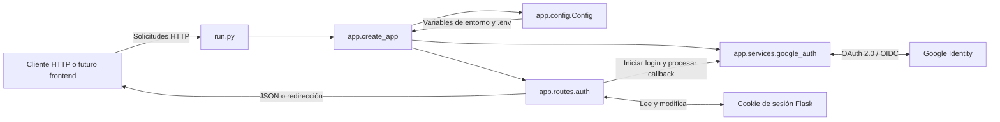
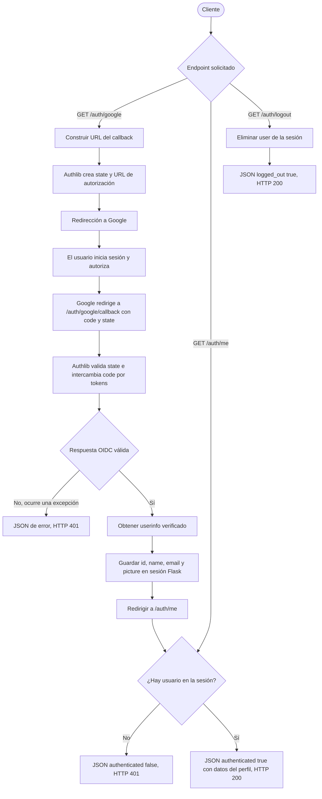

# SICCIA BackEnd

API HTTP independiente construida con Python y Flask. El paquete vive dentro de `SICCIA/BackEnd`, separado de un futuro frontend, y ofrece autenticación con Google mediante OAuth 2.0 / OpenID Connect (OIDC). La aplicación se crea con una factoría Flask, y separa configuración, rutas y comunicación con Google.

## Funcionalidades actuales

- Inicio de sesión con Google (OAuth 2.0 / OpenID Connect).
- Validación completa de la identidad del usuario (firma, emisor, audiencia y expiración del `id_token`), delegada en una librería mantenida (Authlib), sin implementación manual del protocolo.
- Creación de una sesión de aplicación (cookie de Flask) tras el login exitoso.
- Consulta del usuario autenticado.
- Cierre de sesión.
- Persistencia únicamente en la sesión de Flask (sin base de datos) — pensado para incorporar una base de datos más adelante sin reescribir la autenticación.

**No incluye actualmente:** frontend, HTML, base de datos, login con usuario/contraseña, roles, JWT propio, CORS ni configuración de despliegue/producción. La sesión se mantiene con la cookie firmada de Flask; no se emite un token propio.

## Requisitos previos

- Python 3.10 o superior.
- Una cuenta de Google y un proyecto en [Google Cloud Console](https://console.cloud.google.com/) con credenciales OAuth 2.0 (Client ID y Client Secret). Ver sección [Configuración de Google Cloud](#configuración-de-google-cloud).

## Dependencias

Definidas en `requirements.txt`:

| Librería | Uso |
|---|---|
| `Flask` | Framework web: rutas, sesiones, servidor de desarrollo. |
| `Authlib` | Cliente OAuth 2.0 / OpenID Connect. Construye la URL de login, valida `state`, intercambia el `code` por tokens y verifica el `id_token` contra las claves públicas de Google. |
| `python-dotenv` | Carga las variables del archivo `.env` al entorno del proceso. |
| `requests` | Usada internamente por Authlib para las llamadas HTTP a Google. |

## Instalación

Desde la raíz del workspace, entra al backend antes de crear el entorno virtual:

```bash
cd SICCIA/BackEnd

# 1. Crear entorno virtual
python -m venv venv

# 2. Activar entorno virtual
source venv/bin/activate        # macOS / Linux
venv\Scripts\activate.bat       # Windows (cmd)
venv\Scripts\Activate.ps1       # Windows (PowerShell)

# 3. Instalar dependencias
pip install -r requirements.txt

# 4. Crear el archivo de configuración
cp .env.example .env            # en Windows: copy .env.example .env
```

Edita `.env` y completa:

```text
GOOGLE_CLIENT_ID=...
GOOGLE_CLIENT_SECRET=...
FLASK_SECRET_KEY=...
SESSION_COOKIE_SECURE=False
```

`FLASK_SECRET_KEY` se puede generar con:

```bash
python -c "import secrets; print(secrets.token_hex(32))"
```

## Configuración de Google Cloud

1. Entra a [console.cloud.google.com](https://console.cloud.google.com/) y crea un proyecto (o usa uno existente).
2. Ve a **APIs & Services → OAuth consent screen**, elige tipo **External**, y completa nombre de la app y correo de soporte. Los scopes `openid`, `email` y `profile` son básicos y no requieren revisión de Google.
3. Ve a **APIs & Services → Credentials → Create Credentials → OAuth client ID**.
4. En **tipo de aplicación**, elige **Web application**.
5. En **URI de redirección autorizada**, agrega exactamente:
   ```
   http://localhost:5000/auth/google/callback
   ```
6. Copia el **Client ID** y **Client Secret** generados a tu archivo `.env`.

## Ejecución

Desde la raíz del workspace, activa el entorno virtual del backend y ejecuta el módulo como paquete:

```powershell
& .\SICCIA\BackEnd\venv\Scripts\Activate.ps1
python -m SICCIA.BackEnd.run
```

También puedes ejecutar el punto de entrada directamente desde la carpeta del backend:

```powershell
cd SICCIA\BackEnd
python run.py
```

El servidor de desarrollo escucha en `http://localhost:5000`. `run.py` activa `debug=True`, por lo que este modo es solo para desarrollo local; para producción debe usarse un servidor WSGI y una configuración segura.

## Endpoints

| Método | Ruta | Descripción |
|---|---|---|
| `GET` | `/auth/google` | Inicia el flujo: redirige al usuario a la pantalla de login de Google. |
| `GET` | `/auth/google/callback` | URL de retorno de Google. Valida la respuesta y crea la sesión; no se llama manualmente. |
| `GET` | `/auth/me` | Devuelve los datos del usuario autenticado, o `401` si no hay sesión activa. |
| `GET` | `/auth/logout` | Elimina de la sesión los datos del usuario de la aplicación. No cierra la sesión de Google. |

**Respuesta de `/auth/me` autenticado:**
```json
{
  "authenticated": true,
  "id": "1234567890",
  "name": "Nombre Apellido",
  "email": "usuario@gmail.com",
  "picture": "https://..."
}
```

**Respuesta de `/auth/me` sin sesión:**
```json
{ "authenticated": false }
```
(con código HTTP `401`)

## Probar el flujo (sin frontend)

1. Abrir en el navegador: `http://localhost:5000/auth/google`.
2. Iniciar sesión con una cuenta de Google → redirige automáticamente a `/auth/me` mostrando los datos del usuario.
3. Verificar sin sesión:
   ```bash
   curl -i http://localhost:5000/auth/me
   ```
4. Cerrar sesión:
   ```bash
   curl -i http://localhost:5000/auth/logout
   ```

El login en sí debe probarse desde el navegador, porque requiere la pantalla interactiva de Google; `curl`/Postman sirven para inspeccionar `/auth/me` y `/auth/logout` reutilizando la cookie de sesión del navegador.

## Arquitectura del paquete

La factoría `create_app()` carga y valida la configuración, inicializa Authlib y registra el blueprint de autenticación. Las rutas HTTP delegan el protocolo de Google en el servicio; Flask administra la cookie de sesión.



### Estructura actual

```text
SICCIA/
├── __init__.py
└── BackEnd/
   ├── __init__.py
   ├── run.py
   ├── requirements.txt
   ├── .env.example
   ├── README.md
   └── app/
      ├── __init__.py
      ├── config.py
      ├── routes/
      │   ├── __init__.py
      │   └── auth.py
      └── services/
         └── google_auth.py
```

- `SICCIA/__init__.py` y `SICCIA/BackEnd/__init__.py` permiten importar el backend como paquete (`SICCIA.BackEnd`).
- `run.py` es el punto de entrada y admite tanto `python -m SICCIA.BackEnd.run` desde la raíz como `python run.py` desde `SICCIA/BackEnd`.
- `app/__init__.py` define `create_app()`; `config.py` carga `.env` y valida las credenciales requeridas.
- `app/routes/auth.py` expone los endpoints HTTP y `app/services/google_auth.py` encapsula la integración con Authlib.
- `.env` contiene la configuración local y no debe publicarse. `.env.example` sirve como plantilla.

## Flujo de los endpoints

El flujo de login empieza en `/auth/google`. Authlib genera y conserva el `state`; Google devuelve el navegador a `/auth/google/callback`. Tras validar la respuesta, la aplicación guarda solo los datos de perfil necesarios en la sesión y redirige a `/auth/me`.



`/auth/me` y `/auth/logout` pueden llamarse directamente, sin completar el login. La cookie de sesión debe conservarse entre solicitudes para que el cliente siga autenticado. Como no hay CORS configurado, un futuro frontend servido desde otro origen requerirá definir explícitamente CORS y el envío de credenciales/cookies.

### Qué recibe realmente el backend

Del `id_token` ya verificado se extrae `sub` (identificador único y estable de la cuenta, usado como `id`), `name`, `email` y `picture`. Eso es lo único que se guarda en la sesión de Flask. El `access_token` y el `id_token` crudo se usan una sola vez durante el callback y no se persisten. Nunca se recibe ni se almacena la contraseña del usuario.

### Conceptos clave

- **OAuth 2.0**: protocolo de *autorización* — permite acceder a recursos en nombre del usuario sin conocer su contraseña.
- **OpenID Connect (OIDC)**: capa de *autenticación* sobre OAuth 2.0; añade el `id_token`, que identifica quién es el usuario.
- **ID token**: JWT firmado por Google que certifica la identidad.
- **Access token**: credencial para llamar a APIs de Google en nombre del usuario (aquí solo se usa como respaldo si el `id_token` no trae `userinfo`).
- **Sesión de Flask**: cookie firmada por el propio backend que mantiene al usuario "logueado" entre peticiones, independiente de Google.
- **`sub` de Google**: identificador único y permanente de la cuenta — más confiable que el email como clave de usuario, ya que el email puede cambiar.

## Seguridad implementada

- `state` generado y validado automáticamente en el flujo OAuth (protección contra CSRF).
- Validación completa del `id_token` (firma contra las claves públicas de Google, emisor, audiencia y expiración).
- `sub` usado como identificador estable, no el email.
- Cookies de sesión `HttpOnly` y `SameSite=Lax`; `Secure` activable vía `SESSION_COOKIE_SECURE` para producción (HTTPS).
- `GOOGLE_CLIENT_SECRET` y `FLASK_SECRET_KEY` solo en `.env`, excluido de git mediante `.gitignore`.
- No se almacenan contraseñas, tokens de Google ni información innecesaria del usuario.
- Los errores del proceso de autenticación no exponen detalles internos al cliente.

## Extensibilidad

La separación entre `routes/` (HTTP) y `services/` (lógica de Google) permite, por ejemplo, incorporar una base de datos más adelante sustituyendo `session[...] = user_info` por una función que busque o cree el usuario en la base de datos usando `sub` como clave — sin tocar la integración con Google.
